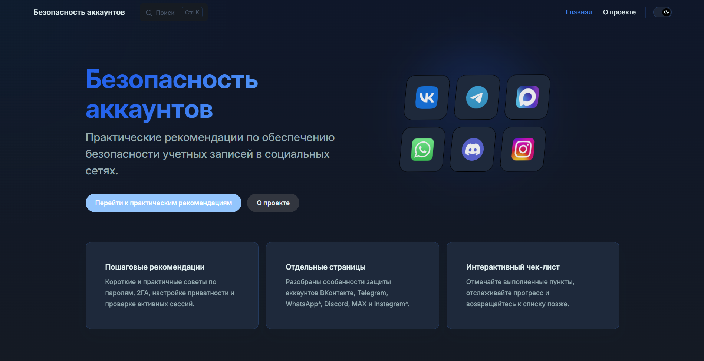

# Учебный сайт по безопасности аккаунтов в социальных сетях



Проект представляет собой готовый демонстрационный информационно-образовательный сайт на `VitePress`, разработанный в рамках Проектного практикума в УрФУ (2 семестр).

Материалы ориентированы на **студентов гуманитарных специальностей** и обычных пользователей и посвящены практической защите аккаунтов в социальных сетях и персональных данных.

> Сайт можно просмотреть онлайн по  [ссылке](https://oppchik.github.io/Social-media-security-guide/), указанной в описании проекта на GitHub (раздел "About").

## Стек


## 🚀 Запуск проекта локально

### Требования

- **Node.js** версии 16 и выше (скачать: https://nodejs.org/)
- **npm** (устанавливается вместе с Node.js)

### Инструкция по установке и запуску

1. **Скачайте архив репозитория:**
   - Перейдите на главную страницу репозитория
   - Нажмите кнопку `Code` → `Download ZIP`
   - Распакуйте архив в удобное место

2. **Откройте терминал** в папке проекта (где находится `package.json`)

3. **Установите зависимости:**
   ```bash
   npm install
   ```

4. **Запустите локальный сервер разработки:**
   ```bash
   npm run docs:dev
   ```

5. **Откройте сайт в браузере:**
   - В терминале появится адрес (обычно `http://localhost:5173`)
   - Перейдите по этому адресу в браузере

## 📦 Сборка проекта

Для создания оптимизированной версии сайта:

```bash
npm run docs:build
```

Для локального просмотра собранной версии:

```bash
npm run docs:preview
```

## 📂 Структура проекта

```text
Social-media-security-guide/
├─ docs/
│  ├─ public/
│  ├─ .vitepress/
│  │  ├─ config.mts
│  │  └─ theme/
│  │     ├─ ChecklistEnhancer.vue
│  │     ├─ SocialGrid.vue
│  │     ├─ checklists.js
│  │     ├─ custom.css
│  │     ├─ infographics.css
│  │     └─ index.js
│  ├─ about.md
│  ├─ checklist.md
│  ├─ discord-security.md
│  ├─ general-security.md
│  ├─ guide.md
│  ├─ importance.md
│  ├─ index.md
│  ├─ infographics.md
│  ├─ mistakes.md
│  ├─ telegram-security.md
│  ├─ vk-security.md
│  ├─ whatsapp-security.md
│  ├─ max-security.md
│  └─ instagram-security.md
├─ node_modules/
├─ .gitignore
├─ package.json
├─ package-lock.json
└─ README.md
```

## 📝 Как редактировать контент

- Основные тексты страниц находятся в папке `docs/`.
- Каждая страница сайта редактируется как отдельный Markdown-файл.
- Навигация верхнего меню и боковой панели настраивается в `docs/.vitepress/config.mts`.
- Визуальный стиль сайта изменяется в `docs/.vitepress/theme/custom.css`.
- Логика интерактивного чек-листа находится в `docs/.vitepress/theme/checklists.js`.

## 🛠️ Как добавить новую страницу

1. Создайте новый Markdown-файл в папке `docs/`, например `new-page.md`.
2. Добавьте заголовок, текст и нужные HTML-блоки в формате Markdown.
3. Добавьте страницу в `nav` и `sidebar` внутри `docs/.vitepress/config.mts`.
4. При необходимости расширьте стили в `docs/.vitepress/theme/custom.css`.
