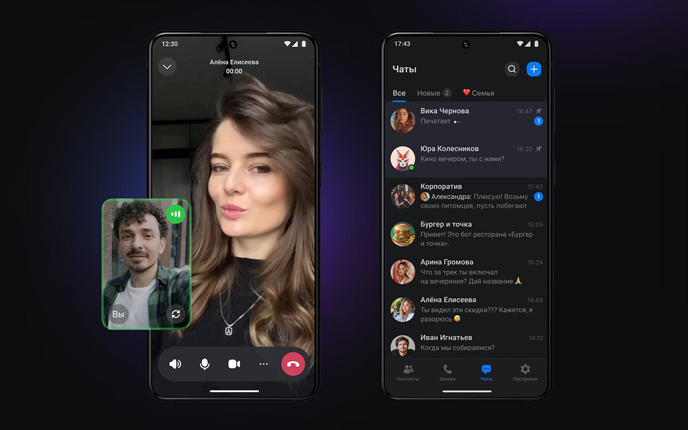

# Безопасность аккаунта MAX

> Безопасность профиля важна с первого входа: новый мессенджер тоже может стать точкой доступа к учебным чатам, контактам и личным данным.
 

<picture>
  <source srcset="./public/max-title.avif" type="image/avif">
  <source srcset="./public/max-title.webp" type="image/webp">
  
</picture>

> Источник фото: https://trends.rbc.ru/

  👀
  

    <strong>Обратите внимание:</strong> если MAX используется для учебной коммуникации, сразу проверьте вход, приватность номера и активные устройства. Даже новый сервис может стать целью фишинга и социальной инженерии.
  

  📚
  

    <strong>Для гуманитарных направлений:</strong> в мессенджере могут появиться группы проектов, обсуждения публикаций, контакты наставников и ссылки на материалы. Настройки безопасности лучше привести в порядок до активного использования.
  

## Что нужно сделать в первую очередь

  

    
🛡️

    

      <h3>Защита аккаунта</h3>
      
Обязательно включите дополнительный пароль и биометрическую блокировку.

    

  

  

    
📱

    

      <h3>Активные сеансы</h3>
      
Регулярно проверяйте и отключайте неизвестные устройства от аккаунта.

    

  

  

    
👻

    

      <h3>Приватность номера</h3>
      
Скройте свой личный номер телефона от посторонних глаз в настройках.

    

  

## Ключевые настройки безопасности

  

 

  

    <h3>Надёжный пароль</h3>
    
Исключает попытки взлома

  

  

    <h3>2FA Защита</h3>
    
Максимальная безопасность

  

  

    <h3>Активные сеансы</h3>
    
Контроль всех устройств

  

## Защита от подозрительных ссылок

  

    
🚫

    <h4>Не открывайте ссылки</h4>
    
Даже если они пришли от знакомых аккаунтов.

  

  

    
⚠️

    <h4>Проверяйте просьбы</h4>
    
Опасайтесь просьб срочно сообщить код входа.

  

  

    
🤖

    <h4>Осторожнее с ботами</h4>
    
Никогда не выдавайте им доступ к личным данным.

  

  

    
📝

    <h4>Проверяйте формы</h4>
    
Ссылки на опросы, конкурсы и регистрацию открывайте только после проверки адреса.

  

## Безопасное восстановление доступа

  

    
Шаг 1: Контроль над номером

    

      
Сначала восстановите контроль над вашим номером телефона через оператора связи, если SIM-карта была утеряна.

    

  

  

    
Шаг 2: Официальное приложение

    

      
Осуществляйте вход исключительно через официальный клиент МАКС во избежание перехвата данных сторонними сервисами.

    

  

  

    
Шаг 3: Проверка сеансов

    

      
Сразу же проверьте список активных сеансов и принудительно завершите все подключения на неизвестных вам устройствах.

    

  

  

    
Шаг 4: Обновление пароля

    

      
Обновите облачный пароль дополнительной защиты (двухфакторная аутентификация), чтобы закрепить контроль за аккаунтом.

    

  

