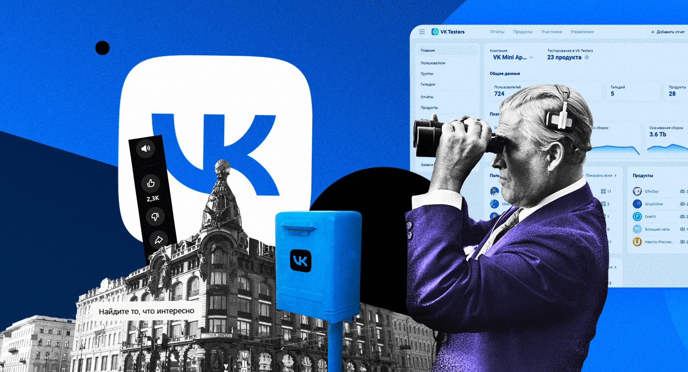

# Безопасность аккаунта ВКонтакте

  
🔑

  

    <strong>Ваш цифровой паспорт:</strong> ВКонтакте — это не просто мемы и музыка. Это центр вашей цифровой жизни: от личных переписок до авторизации в банковских и рабочих сервисах.
  

> Контроль доступа и приватность — это не паранойя, а гигиена в сети.
 

> Источник фото: Skillbox Media

## Практические рекомендации

  

    

      <h3>Проверьте номер телефона и почту</h3>
      
Убедитесь, что к аккаунту привязаны актуальные контакты, к которым есть доступ только у вас.

    

    

      
    

  

   

    

      <h3>Смените слабый пароль</h3>
      
Если пароль короткий или использовался в других сервисах, замените его на уникальный и длинный.

    

    

      
    

  

  

    

      <h3>Включите подтверждение входа</h3>
      
Активируйте дополнительные проверки входа, если они доступны, и сохраните резервные данные для восстановления.

    

    

      
    

  

## Что проверить в настройках ВКонтакте

  

    <strong>Сеансы</strong>
    
История входов и активные устройства. Завершите всё лишнее.

  

  

    <strong>Сервисы</strong>
    
Все подключенные приложения и сайты, у которых есть доступ к профилю.

  

  

    <strong>Данные</strong>
    
Видимость номера телефона, даты рождения, списка друзей и ваших фото.

  

  

    <strong>Связь</strong>
    
Настройки того, кто может писать вам и приглашать в сообщества.

  

  

    <strong>Оповещения</strong>
    
Уведомления о входе в аккаунт и любых изменениях настроек защиты.

  

## Как снизить риск фишинга во ВКонтакте

*   Пароли **Никогда** не вводите пароль после перехода по ссылкам из ЛС.
*   Коды Не отправляйте коды подтверждения даже тем, кто представляется вашим знакомым.
*   Приложение Игнорируйте сообщения о «проверке страницы», если они пришли не через официальные каналы.
*   Браузер Всегда проверяйте адресную строку: там должно быть строго `vk.com`.

## Действия при взломе

  
⚠️

  

    <strong>После подозрительной активности:</strong> Если вы заметили чужие заходы или странную активность, выполните следующие шаги максимально быстро.
  

  
  

    
01

    
Сразу смените пароль.

  

  

    
02

    
Завершите все сеансы, кроме текущего доверенного устройства.

  

  

    
03

    
Проверьте подключенные приложения.

  

  

    
04

    
Убедитесь, что ваш номер телефона и почта не были изменены.

  

  

    
05

    
Предупредите знакомых, если от вашего имени могли рассылаться странные сообщения.

  

