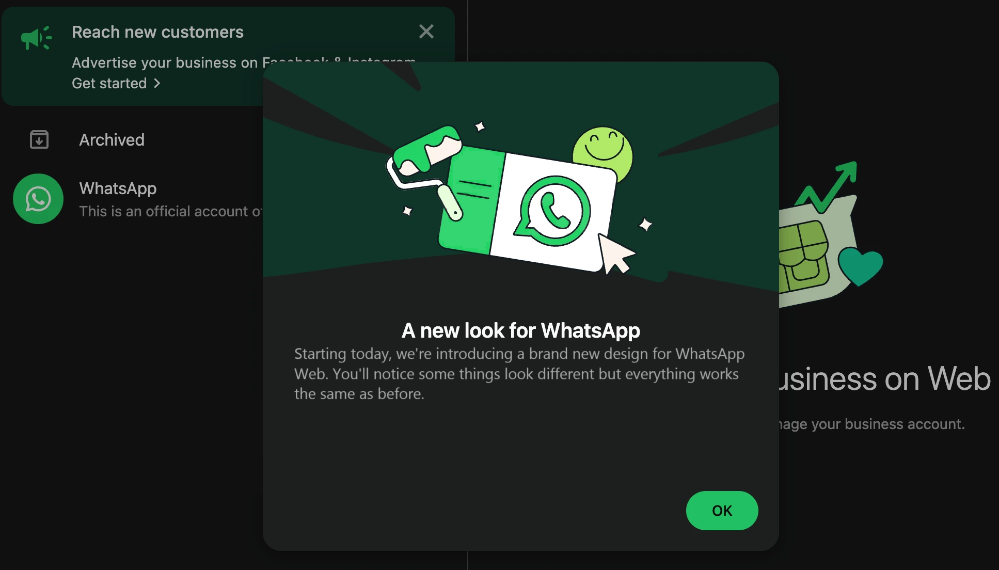

# Безопасность аккаунта WhatsApp*

<picture>
  <source srcset="./public/Vc-title.avif" type="image/avif">
  <source srcset="./public/Vc-title.webp" type="image/webp">
  
</picture>

> Источник фото: Блог Касперского

  

    ✔✔
  

  

    <strong>Ваша конфиденциальность — основа доверия.</strong> WhatsApp* часто используют для связи с группой, преподавателями, родителями и проектными командами. Сквозное шифрование защищает сообщения, но сам аккаунт всё равно нужно беречь от перехвата.
  

> 🛡️ Защита аккаунта — ваш единственный барьер между вами и гифками с добрым утром.
 

  

    👀
  

  

    <strong>Учебный сценарий:</strong> если мошенники получат доступ к вашему номеру, они могут писать от вашего имени одногруппникам, просить деньги, отправлять фейковые ссылки или вмешиваться в командные договоренности.
  

## Что нужно сделать в первую очередь

  

    
🔐

    

      <h3>Двухфакторная защита</h3>
      
Установите PIN-код, который будет запрашиваться при регистрации вашего номера на новом устройстве.

    

  

  

    
🖥️

    

      <h3>Связанные устройства</h3>
      
Регулярно проверяйте список активных сессий в WhatsApp Web* и Desktop. Выходите из системы на чужих ПК.

    

  

  

    
👤

    

      <h3>Личные данные</h3>
      
Ограничьте видимость вашего фото профиля и времени последнего посещения только для ваших контактов.

    

  

## Ключевые настройки безопасности

  

    

      
1

      

    

    

      

        <h3>Перейдите в настройки</h3>
        
Установите достаточно сложный пароль, чтобы исключить попытки взлома.

      

      

        
      

    

  

  

    

      
2

      

    

    

      

        <h3>Двухшаговая проверка</h3>
        
PIN защищает аккаунт при повторном входе и уменьшает риск захвата после перехвата кода.

      

      

        
      

    

  

  

    

      
3

    

    

      

        <h3>Зайдите в «Конфиденциальность»</h3>
        
Настройте видимость номера телефона, фото профиля и списка исключений.

      

      

        
      

    

  

## Защита от спама и фишинга

  

    <strong>Блокировка неизвестных</strong>
    Сразу блокируйте и жалуйтесь на подозрительные сообщения от незнакомых номеров.
  

  

    <strong>Групповые настройки</strong>
    Запретите добавлять вас в группы всем, кто не входит в ваш список контактов.
  

  

    <strong>Исчезающие сообщения</strong>
    Используйте этот режим для особенно чувствительной переписки.
  

  

    <strong>Учебные группы</strong>
    Проверяйте, кто добавляет вас в группы, и не открывайте файлы от незнакомых участников.
  

  

    <strong>Проектные договоренности</strong>
    Важные дедлайны, ссылки и материалы лучше дублировать вне одного мессенджера.
  

## Безопасное восстановление

  

    

    

      <h4>Подтверждение номера</h4>
      
Переустановите приложение и подтвердите номер через SMS или звонок.

    

  

  

    

    

      <h4>Сброс PIN-кода</h4>
      
Если вы забыли PIN, используйте привязанную почту для его восстановления.

    

  

